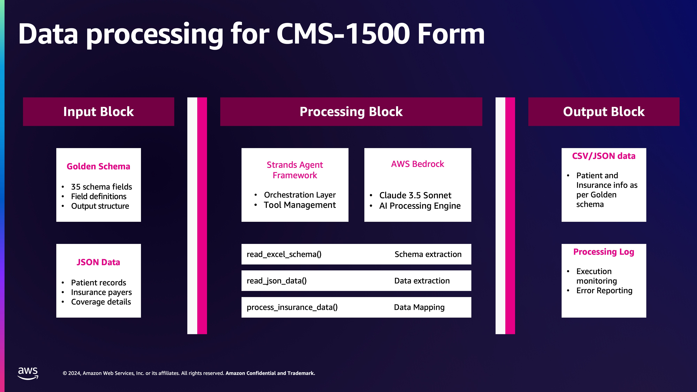

# Automate CMS-1500 form filing with Amazon Bedrock and Strands Agent

An AI-powered insurance data processing system that transforms patient insurance information from JSON format to structured CSV output using Amazon Bedrock and the Strands Agents SDK. This tool automates the complex task of mapping insurance data fields according to predefined schemas, making it ideal for healthcare organizations processing patient coverage information.

## Features

- **Schema-based Field Mapping**: Automatically maps insurance data fields according to Excel-defined schemas
- **Multi-payer Support**: Processes multiple insurance payers per patient with proper ranking (Primary, Secondary, etc.)
- **AI-Powered Processing**: Leverages Amazon Bedrock's Claude 3.5 Sonnet model for intelligent data transformation
- **Strands Agent Integration**: Uses the Strands Agents SDK for structured AI tool orchestration
- **Patient Information Extraction**: Extracts comprehensive patient demographics, addresses, and insurance details
- **Automated CSV Generation**: Produces clean, structured CSV output ready for downstream systems
- **Excel Schema Reading**: Supports dynamic schema definitions through Excel files
- **Error Handling & Logging**: Comprehensive logging and error handling for production use

## Prerequisites

- **Python:** Version 3.10 or higher
- **AWS Account**: Active AWS account with appropriate permissions
- **Amazon Bedrock Access**: Access to Amazon Bedrock service in `us-east-1` region for the folloiwng models:
   - **Claude 3.5 Sonnet v2 Model**: use cross region inference  us.anthropic.claude-3-5-sonnet-20240620-v1:0
   - **Nova Pro**: use cross region inference   us.amazon.nova-pro-v1:0
   - **llama4-scout-17b-instructt**: use cross region inference   us.meta.llama4-scout-17b-instruct-v1:0
- **AWS Credentials**: Properly configured AWS credentials (via AWS CLI, IAM roles, or environment variables)
- **Amazon SageMaker AI Studio:** Access to Jupyter notebook for development (optional)


## Installation

- **Python**: Version 3.10 or higher

1. **Clone the repository**:
   ```bash
   git clone https://github.com/purnasanyal/Strand-agents-for-CMS-1500-form.git
   
   ```

2. **Install dependencies**:
   ```bash
   pip install -r requirements.txt
   ```

3. **Configure AWS credentials** (choose one method):
   ```bash
   # Method 1: AWS CLI
   aws configure
   
   # Method 2: Environment variables
   export AWS_ACCESS_KEY_ID=your_access_key
   export AWS_SECRET_ACCESS_KEY=your_secret_key
   export AWS_DEFAULT_REGION=us-east-1
   ```

4. **Verify Amazon Bedrock access**:
   ```bash
   aws bedrock list-foundation-models --region us-east-1
   ```

## Architecture Diagram



The system follows a straightforward data processing pipeline:

1. **Input Layer**: Excel schema and JSON patient data files
2. **Processing Layer**: Strands Agent orchestrates four specialized tools using Amazon Bedrock
3. **Output Layer**: Structured CSV file ready for downstream systems

## Usage

### Basic Usage

1. **Review the files**:
   - Golden schema file (e.g., `golden-schema-v2.xlsx`) 
   - JSON patient data file (e.g., `anonymized-patient-data.json`) 

2. **Update file paths** in `insurance_strands_agent.py`, provide full file path:
   ```python
   SCHEMA_PATH = '/home/sagemaker-user/Strand-PCC/golden-schema-v2.xlsx'
   JSON_PATH = '/home/sagemaker-user/Strand-PCC/anonymized-patient-data.json'
   OUTPUT_PATH = '/home/sagemaker-user/Strand-PCC/llama4-insurance_plans_output.csv'
   ```

3. **Run the processing script**:
   ```bash
   python insurance_strands_agent.py
   ```
4. **Output csv and JSON file will be generated**:
   ```bash
   Review llama4-insurance_plans_output.csv . This file will have the necessary data for CMS-1500 form
   ```
                                        **The Procject is completed**
=======================================================================================================


## Troubleshooting

### Common Issues

**1. Amazon Bedrock Access Denied**
```
Error: AccessDeniedException: User is not authorized to perform: bedrock:InvokeModel
```
**Solution**: Ensure your AWS credentials have the necessary Bedrock permissions:
```json
{
    "Version": "2012-10-17",
    "Statement": [
        {
            "Effect": "Allow",
            "Action": [
                "bedrock:InvokeModel",
                "bedrock:ListFoundationModels"
            ],
            "Resource": "*"
        }
    ]
}
```

**2. Model Not Available**
```
Error: ValidationException: The model ID is not supported
```
**Solution**: Verify the model is available in your region and you have access:
```bash
aws bedrock list-foundation-models --region us-east-1 | grep claude-3-5-sonnet
```

**3. File Not Found Errors**
```
Error: FileNotFoundError: [Errno 2] No such file or directory
```
**Solution**: Update file paths in the script to match your local file locations:
```python
SCHEMA_PATH = '/absolute/path/to/your/schema.xlsx'
JSON_PATH = '/absolute/path/to/your/data.json'
```

**5. Timeout Issues**
```
Error: ReadTimeoutError: Read timed out
```
**Solution**: The script already includes extended timeout settings. For very large files, consider increasing further:
```python
client_args={
    'config': {
        'read_timeout': 600,  # 10 minutes
        'connect_timeout': 600
    }
}
```
### Contributing

1. Fork the repository
2. Create a feature branch (`git checkout -b feature/amazing-feature`)
3. Commit your changes (`git commit -m 'Add amazing feature'`)
4. Push to the branch (`git push origin feature/amazing-feature`)
5. Open a Pull Request6. 
### Getting Help

- Check the [Strands Agents Documentation](https://docs.strands.ai)
- Review [Amazon Bedrock Documentation](https://docs.aws.amazon.com/bedrock/)
- Open an issue in this repository for project-specific problems

## License

This project is licensed under the MIT License - see the [LICENSE](LICENSE) file for details.

---

**Note**: This tool processes sensitive healthcare data. Ensure compliance with HIPAA and other relevant regulations when handling patient information. Always use appropriate data encryption and access controls in production environments.
